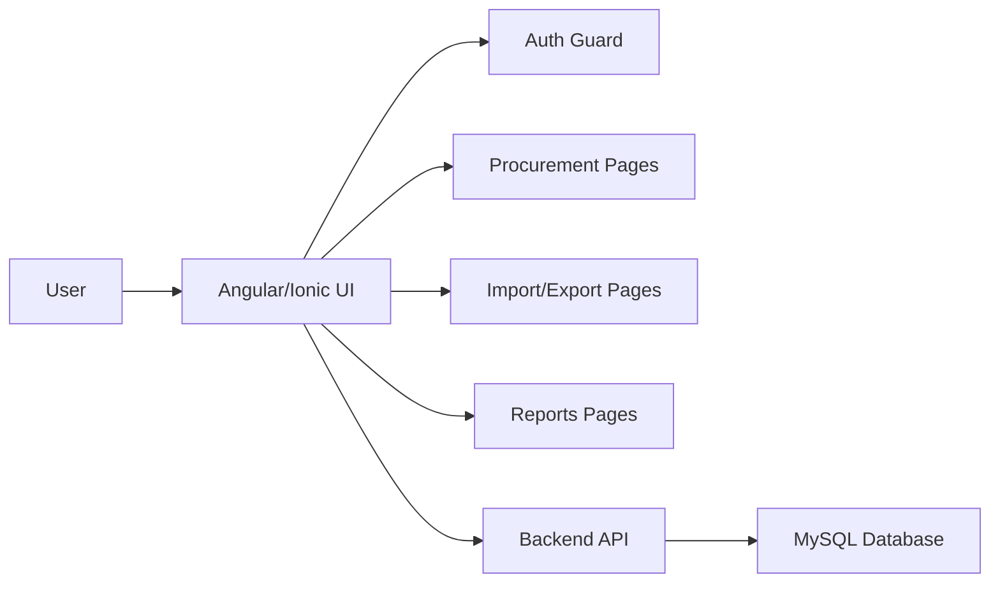

# ARC Procurement System Frontend


## Overview

The frontend for the ARC Procurement Tracking System is an Angular and Ionic web application designed for ARC users to monitor, update, and manage procurement records through a responsive enterprise interface. It connects to the backend API for authentication, procurement workflows, reporting, and import/export operations.

## What the User Sees

The application provides a practical operating view for procurement administration:

- A secure login experience using ARC Active Directory credentials.
- A dashboard with procurement totals, status summaries, overdue alerts, and chart-based reporting.
- A procurement management screen for filtered searches, pagination, assignment of responsible users, comments, and record navigation.
- A procurement detail view for editing milestone dates, updating workflow status, exporting a procurement record, and reviewing audit history.
- An import/export workspace for manual procurement entry, bulk Excel import, template download, and export actions.
- A reporting page for status, campus, and monthly trend analytics.
- An administrator-only user management page for creating and maintaining ARC users and roles.

## Main Pages and Routes

- `/login` — authentication entry page
- `/dashboard` — summary and operational overview
- `/procurements` — procurement list and filters
- `/procurements/:id` — procurement detail and workflow updates
- `/import-export` — bulk entry, Excel import, template download, and export
- `/reports` — dashboards and analytics views
- `/users` — user administration for administrators

## Architecture



## Technology Stack

- Angular 20
- Ionic Framework
- Capacitor
- RxJS
- Chart.js for reporting visuals
- TypeScript

## Installation

```bash
cd frontend
npm install
```

## Environment Configuration

The app reads its API endpoint from [frontend/src/environments/environment.ts](src/environments/environment.ts):

- `apiUrl: http://localhost:3001/api`
- `appName: ARC Procurement Tracking System`

## Local Development

1. Start the backend API first.
2. Launch the frontend:

```bash
npm start
```

The development server will run the Angular application locally, typically on the default Angular development port.

## Authentication Flow

The frontend uses the `AuthService` to store the JWT token and current user in local storage. Route access is protected by `AuthGuard` and role-based access is enforced by `RoleGuard` for restricted areas such as import/export and user management.

## UI Capabilities

- Responsive Ionic layout for desktop and tablet usage
- Toast notifications for success and error feedback
- Role-based menu items and action visibility
- Form-driven procurement entry and status updates
- Charts for procurement status, campus distribution, and trends

## Build and Packaging

The project includes Angular and Capacitor tooling, so it can be served as a web application and extended for mobile packaging when required.

```bash
npm run build
```

## Security

- Token-based session management through the backend JWT flow
- Protected routes for authenticated and role-restricted screens
- No direct storage of user passwords in the frontend; authentication is delegated to the API

## Support

For frontend issues, UI defects, route problems, or deployment concerns, confirm the active backend endpoint and the current environment configuration before making changes.

## Licensing

This frontend component is distributed under the ISC license as defined in the project package metadata.
