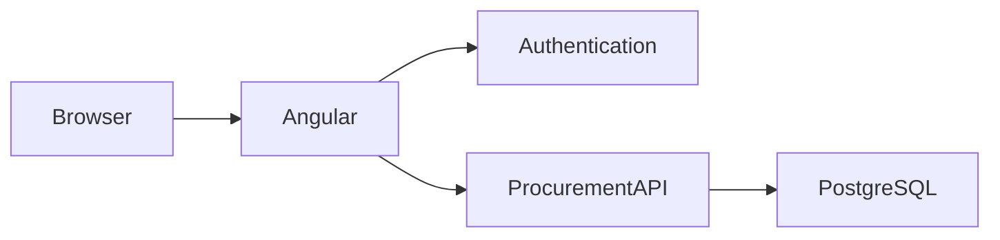

# ARC Procurement Frontend

<p align="center">
  
</p>

<p align="center">


</p>

---

# Overview

The **ARC Procurement Frontend** is a responsive web application providing procurement staff, managers, and finance personnel with a modern interface for managing procurement activities.

## Features

- Dashboard
- Requisition Management
- Supplier Directory
- Approval Workflow
- Purchase Orders
- Reporting Dashboard
- Responsive Design
- Authentication Integration
- Role-Based Navigation

---

# Screenshots

```
docs/images/

dashboard.png

requisition.png

approvals.png

reports.png

suppliers.png
```

---

# Architecture



---

# Technology Stack

| Layer | Technology |
|---------|------------|
| Frontend | Angular 18 |
| UI | Ionic 8 |
| Styling | SCSS |
| Charts | Chart.js |
| Authentication | JWT |
| Maps | Leaflet (optional) |

---

# Installation

```bash
git clone https://github.com/ARC/arcprocurement-frontend

cd arcprocurement-frontend

npm install

ionic serve
```

---

# Configuration

```typescript
apiUrl=http://localhost:3000

authUrl=http://localhost:3001
```

---

# Folder Structure

```
src/

app/

components/

pages/

services/

guards/

assets/

theme/

environments/
```

---

# Authentication

- JWT Login
- Route Guards
- Role-Based Menus
- Session Timeout
- Token Refresh

---

# Reporting

- Procurement Status
- Department Spending
- Supplier Statistics
- Purchase Orders
- Approval Performance

---

# Deployment

```bash
ionic build

pm2 serve www 8100
```

---

# Security

- Route Guards
- HTTPS
- JWT Storage
- Secure API Calls

---

# Documentation

```
docs/

user-guide.md

deployment.md

screenshots/
```

---

# License

Copyright © Agricultural Research Council (ARC)

All Rights Reserved.
